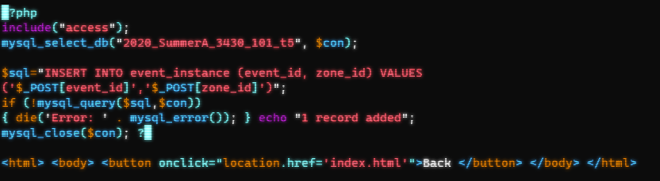
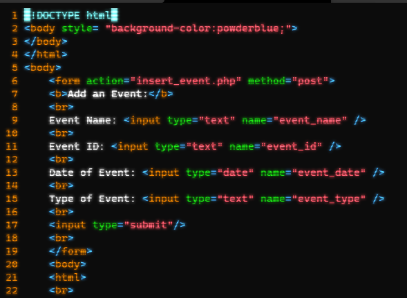

# Traffic-Office-Database
The traffic office database is a MySql database designed by Joseph Deming, Andy Richard, and Logan Matthis.

## **Table of Contents**
1. [Introduction](#Introduction)
2. [Features](#Features)
3. [Examples](#Examples)
4. [Installation](#Installation)
5. [FAQ](#FAQ)
6. [Support](#Support)
7. [Contribute](#Contribute)
8. [License](#License)

## Introduction
This database was designed around the needs and specifications for a traffic office. This database is capable of tracking
the following records:
- Violation tickets
- Staff members
- Traffic zones and lots
- Events
- Equipment providers
- Inventory on equipment
The database was designed as a relational database, tables can use keys from other tables for querying the database.

## Features
1. A PHP website is provided for quick and easy installation.
2. The database is not limited to the provided website. A third party site can be used.

## Examples
- The information can be inserted into the database through either phpMyAdmin or at command line.
  
  A new staff member has been added to the database via command line.
  The parameters for the staff member table are
  - First Name 
  - Middle Initial
  - Last name
  - Social Security Number
  - Date of birth
  - Address
  - Gender
  - Salary
  - Supervisor SSN
  - Department number

- The database can be built into any website with PHP
  
  

## Installation
   Installation is made quick and easy. To install the database in MySql follow these instructions.
   1. Navigate to the directory where you wish to store the resources and PHP for this database.
   2. Place the "create_traffic_office" database script into the directory and launch MySql via command line.
   3. Once in MySql run the following commands: 
    - $> CREATE DATABASE traffic_office;
    - $> USE traffic_office
    - $> source "path to script"
  4. Now the database should be installed.
  5. An Access file will need to be constructed to give the PHP site access to the database.
    - This Access file should be named "Access" and requires login information to access the database.
  6. Place the PHP files in the chosen web-directory with the Access file. 
  7. Installation Should now be complete, the database is ready for data and the website is ready to be viewed.

## FAQ
  1. 
  
## Support
  Here is a list of common errors and explanations for trouble shooting:
  - **ERROR**: *Duplicate Entry for primary key:*
           This indicates that the Identification number for the data being inserted matches an existing entity in the database.
           
  - **SOLUTION**: Query the database to see if the entity currently exists. If it does then update the fields necessary.
           If the entity does not exist then try inserting again. If nothing works contact us for support.
           
  - **ERROR**: *Data too long for column* 
           This indicates that the value given for one of the entries is longer than the allocated space.
           
  - **SOLUTION**: Refer to the information below on spacing and sizes for data entries.
           ------------------------------------
           | Data type    |     Size          |
           | :---         |              ---: | 
           | ID Number    | 9 Digits          |
           | Name         | 20 Characters     |
           | Phone Number | 10 digits no "-"  |
           | Dates        | Use the date tool |
           ------------------------------------
  - **Error**: *Incorrect integer value*
           This indicates that the value given in the specified field is not a number.
           
  - **SOLUTION**: Check your insert script again to make sure a character wasn't typed
           
  ### For other unlisted errors and general support contact us for assistance.
  
## Contribute
  - Requests for fixes and additional features can be made to the Traffic Office Database gitHub
  - https://github.com/Demingjm37/Traffic-Office-Database.git
## License
  The Traffic Office Database designs and scripts are licensed under the [MIT](https://github.com/Demingjm37/Traffic-Office-Database/blob/main/LICENSE)cense
  
   
